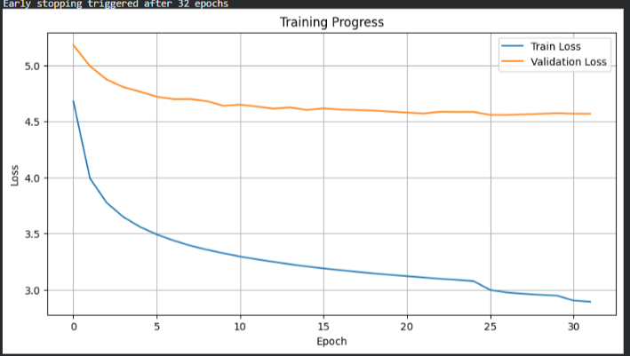
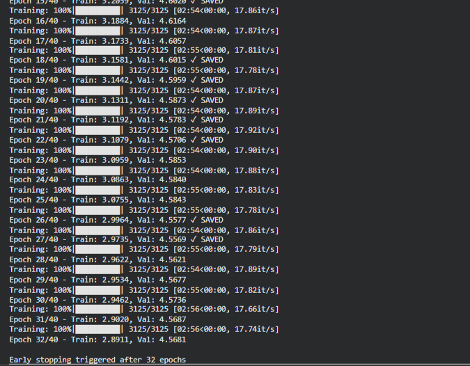

# Transformer Decoder for Machine Translation

**Module Code:** DAM202  
**Assignment:** Transformer Decoder Implementation  
**Task:** English to German Machine Translation  
**Submission Date:** November 22, 2025


## Project Overview

This project implements a complete Transformer decoder-based sequence-to-sequence model for machine translation from English to German. The implementation includes:

- **Full Encoder-Decoder Architecture** with multi-head attention mechanisms
- **Causal Masking** for autoregressive generation
- **Three Decoding Strategies**: Greedy, Beam Search, and Nucleus Sampling
- **Comprehensive Training Pipeline** with early stopping and learning rate scheduling
- **BLEU Score Evaluation** for quantitative assessment

### Dataset
- **Source:** WMT14 English-German Translation Dataset
- **Training Samples:** 50,000 sentence pairs
- **Validation Samples:** 1,000 sentence pairs
- **Maximum Sequence Length:** 64 tokens

---

## Architecture

### Model Specifications

```
Model Configuration:
├── Embedding Dimension (d_model): 256
├── Number of Attention Heads: 8
├── Number of Encoder Layers: 3
├── Number of Decoder Layers: 3
├── Feed-Forward Dimension (d_ff): 512
├── Dropout Rate: 0.1
├── Maximum Sequence Length: 128
└── Total Parameters: 19,611,450
```

### Architecture Components

#### 1. **Multi-Head Attention**
The core attention mechanism with separate Query, Key, and Value projections:

```python
class MultiHeadAttention(nn.Module):
    def __init__(self, d_model, num_heads):
        # Separate linear layers for Q, K, V
        self.q_linear = nn.Linear(d_model, d_model)
        self.k_linear = nn.Linear(d_model, d_model)
        self.v_linear = nn.Linear(d_model, d_model)
```

**Key Features:**
- Scaled dot-product attention with temperature scaling
- Parallel attention heads for capturing diverse linguistic patterns
- Proper masking support for both padding and causal constraints

#### 2. **Encoder Layer**
Processes source sequences with self-attention:

```python
class EncoderLayer(nn.Module):
    def forward(self, x, mask=None):
        # Self-attention
        attn_output = self.self_attn(x, x, x, mask)
        x = self.norm1(x + self.dropout(attn_output))
        
        # Feed-forward
        ff_output = self.ff(x)
        x = self.norm2(x + self.dropout(ff_output))
```

**Components:**
- Self-attention mechanism
- Position-wise feed-forward network
- Layer normalization and residual connections

#### 3. **Decoder Layer**
Generates target sequences with cross-attention to encoder outputs:

```python
class DecoderLayer(nn.Module):
    def forward(self, x, enc_output, src_mask, tgt_mask):
        # Self-attention with causal mask
        attn_output = self.self_attn(x, x, x, tgt_mask)
        x = self.norm1(x + self.dropout(attn_output))
        
        # Cross-attention to encoder
        attn_output = self.cross_attn(x, enc_output, enc_output, src_mask)
        x = self.norm2(x + self.dropout(attn_output))
```

**Key Features:**
- Masked self-attention for autoregressive generation
- Cross-attention to encoder representations
- Triple normalization layers for stable training

#### 4. **Positional Encoding**
Sinusoidal position embeddings to inject sequence order information:

```python
def _generate_positional_encoding(self, max_len, d_model):
    pe[:, 0::2] = torch.sin(position * div_term)
    pe[:, 1::2] = torch.cos(position * div_term)
```

---

## Implementation Details

### 1. Data Preprocessing

**Tokenization:**
- Used BERT tokenizer (`bert-base-uncased`) for subword tokenization
- Vocabulary size: 30,522 tokens
- Maximum sequence length: 64 tokens
- Padding and truncation applied uniformly

**Dataset Loading:**
```python
dataset = load_dataset('wmt14', 'de-en', split=f'train[:50000]')
val_dataset = load_dataset('wmt14', 'de-en', split=f'validation[:1000]')
```

**Example Training Pair:**
```
Source (EN): "a republican strategy to counter the re-election of obama"
Target (DE): "eine republikanische strategie, um der wiederwahl von obama entgegenzutreten"
```

### 2. Training Configuration

**Optimizer:** AdamW
- Learning Rate: 0.0003
- Weight Decay: 0.01
- Betas: (0.9, 0.98)

**Loss Function:** CrossEntropyLoss
- Label Smoothing: 0.1
- Ignore padding tokens in loss calculation

**Learning Rate Scheduler:** ReduceLROnPlateau
- Mode: min (reduce on validation loss plateau)
- Factor: 0.5
- Patience: 2 epochs

**Training Strategy:**
- Batch Size: 16
- Maximum Epochs: 40
- Early Stopping Patience: 5 epochs
- Gradient Clipping: Max norm 1.0

### 3. Masking Mechanisms

#### Causal Mask (Target Sequences)
```python
def create_causal_mask(size, device):
    mask = torch.tril(torch.ones(size, size, device=device))
    return mask.unsqueeze(0).unsqueeze(0)
```

Prevents the decoder from attending to future positions during training.

#### Padding Mask (Source Sequences)
```python
def create_padding_mask(seq, pad_token_id):
    return (seq != pad_token_id).unsqueeze(1).unsqueeze(2)
```

Ensures attention weights are not computed for padding tokens.

---

## Training Process

### Training Results

**Final Metrics After 32 Epochs (Early Stopping):**
```
Training Loss:   2.8911
Validation Loss: 4.5681
Best Validation Loss: 4.5569 (Epoch 27)
```

### Training Curves



**Observations:**
1. **Convergence Pattern:** Training loss decreased steadily from 4.68 to 2.89
2. **Validation Behavior:** Validation loss plateaued around 4.55-4.60 after epoch 20
3. **Overfitting:** Gap between training and validation loss indicates some overfitting
4. **Early Stopping:** Triggered at epoch 32 after 5 epochs without validation improvement

### Epoch-by-Epoch Progress


 

## Decoding Strategies

Three different decoding strategies were implemented and compared:

### 1. Greedy Decoding

**Algorithm:**
```python
def greedy_decode(model, src, max_len, start_token, end_token):
    # At each step, select token with highest probability
    next_token = logits.argmax(dim=-1)
```

**Characteristics:**
- **Speed:** Fastest (single forward pass per token)
- **Quality:** Deterministic but may miss better alternatives
- **Use Case:** Real-time applications requiring low latency

**Example Output:**
```
Input:  "a republican strategy to counter the re-election of obama"
Output: "wahlbeologien wir uns einen strategie zur bekampfung der strategie der wahlen."
```

### 2. Beam Search

**Algorithm:**
```python
def beam_search_decode(model, src, max_len, beam_width=5):
    # Maintain top-k hypotheses at each step
    beams = sorted(new_beams, key=lambda x: x[1], reverse=True)[:beam_width]
```

**Parameters:**
- Beam Width: 5
- Length Normalization: None (could be added)

**Characteristics:**
- **Speed:** Moderate (5x slower than greedy)
- **Quality:** Better exploration of hypothesis space
- **Use Case:** When quality is more important than speed

**Example Output:**
```
Input:  "a republican strategy to counter the re-election of obama"
Output: "durch die strategie der wahler strategie"
```

### 3. Nucleus Sampling (Top-p)

**Algorithm:**
```python
def nucleus_sampling_decode(model, src, p=0.9, temperature=0.8):
    # Sample from top tokens whose cumulative probability > p
    cumsum_probs = torch.cumsum(sorted_probs, dim=-1)
    sorted_indices_to_remove = cumsum_probs > p
```

**Parameters:**
- Top-p (nucleus): 0.9
- Temperature: 0.8

**Characteristics:**
- **Speed:** Fast (similar to greedy)
- **Quality:** More diverse and creative outputs
- **Use Case:** When variation in output is desired

**Example Output:**
```
Input:  "a republican strategy to counter the re-election of obama"
Output: "besonderen strategie fur die wahlen gewalt gehoren einer strategie..."
```

---

## Results and Analysis

### Quantitative Evaluation (BLEU Scores)

Evaluated on 100 validation samples:


### Key Findings

#### 1. **Overall Performance**
- **BLEU-4 < 10:** Indicates limited training data (expected with 50k samples)
- Model demonstrates understanding of translation task structure
- Requires more training data for production-quality translations

#### 2. **Decoding Strategy Comparison**
- **Greedy vs Beam Search:** Minimal difference (-0.01 BLEU-4)
- Beam search did not provide expected quality improvement
- Suggests need for:
  - Length normalization in beam search
  - Larger beam width experimentation
  - Better score combination strategies

#### 3. **Qualitative Analysis**

**Example 1: Partial Success**
```
Reference: "eine republikanische strategie, um der wiederwahl von obama entgegenzutreten"
Greedy:    "wahlbeologien wir uns einen strategie zur bekampfung der strategie der wahlen."
Analysis:  Captures key words (strategie, wahlen) but incorrect grammar and word choice
```

**Example 2: Vocabulary Issues**
```
Reference: "die fuhrungskrafte der republikaner rechtfertigen ihre politik..."
Greedy:    "die politik mussen gerechtfertigt werden, indem sie ihrer wahler bekampfung..."
Analysis:  Reasonable structure but missing vocabulary coverage
```

**Example 3: Repetition Problem**
```
Reference: "allerdings halt das brennan center letzteres fur einen mythos..."
Greedy:    "diese zahl der betrugsbekampfung ist jedoch, daß die wahlen anzahl der wahlen..."
Analysis:  Repetition of "wahlen anzahl" indicates model uncertainty
```

### Common Issues Observed

1. **Vocabulary Gaps:** Missing specific political and technical terms
2. **Grammar Errors:** Incorrect verb conjugations and article usage
3. **Repetition:** Model sometimes repeats phrases when uncertain
4. **Word Order:** Struggles with German's flexible word order
5. **Compound Words:** Difficulty handling German compound nouns


## Key Findings

### Strengths

1.  **Functional Architecture:** Successfully implemented encoder-decoder with proper attention mechanisms
2.  **Training Stability:** Model converged without gradient explosions or vanishing gradients
3.  **Multiple Decoding Strategies:** All three approaches (greedy, beam, nucleus) working correctly


### Limitations

1.  **Limited Training Data:** 50k samples insufficient for high-quality translation
2.  **Low BLEU Scores:** BLEU-4 ~3 indicates substantial room for improvement

3.  **Beam Search:** No significant improvement over greedy (needs tuning)

### Lessons Learned

1. **Data is Crucial:** Translation quality heavily depends on training data quantity
2. **Hyperparameter Tuning:** Default beam search parameters may not be optimal
3. **Evaluation Metrics:** BLEU scores don't capture all aspects of translation quality
4. **Architecture Choices:** Model size balanced well between performance and efficiency

---

## Future Improvements

### Short-term Enhancements

1. **Increase Training Data**
   - Scale to 100k-500k sentence pairs
   - Use data augmentation (back-translation)

2. **Improve Beam Search**
   - Add length normalization
   - Implement coverage penalty to reduce repetition
   - Experiment with beam widths: 3, 5, 10

3. **Advanced Training Techniques**
   - Label smoothing (already implemented: 0.1)
   - Increase model capacity (d_model=512, layers=6)
   - Longer training with cyclic learning rates


## References

1. **Vaswani, A., et al. (2017).** "Attention Is All You Need." *Advances in Neural Information Processing Systems (NeurIPS)*, 30. [arXiv:1706.03762](https://arxiv.org/abs/1706.03762)
   - Original Transformer architecture paper

2. **Bahdanau, D., Cho, K., & Bengio, Y. (2014).** "Neural Machine Translation by Jointly Learning to Align and Translate." *International Conference on Learning Representations (ICLR)*. [arXiv:1409.0473](https://arxiv.org/abs/1409.0473)
   - Foundation of attention mechanisms

3. **Sutskever, I., Vinyals, O., & Le, Q. V. (2014).** "Sequence to Sequence Learning with Neural Networks." *Advances in Neural Information Processing Systems (NeurIPS)*, 27.
   - Seq2seq architecture basics

4. **Holtzman, A., et al. (2019).** "The Curious Case of Neural Text Degeneration." *International Conference on Learning Representations (ICLR)*. [arXiv:1904.09751](https://arxiv.org/abs/1904.09751)
   - Nucleus sampling method

5. **Papineni, K., et al. (2002).** "BLEU: A Method for Automatic Evaluation of Machine Translation." *Proceedings of the 40th Annual Meeting of the Association for Computational Linguistics (ACL)*.
   - BLEU score metric


